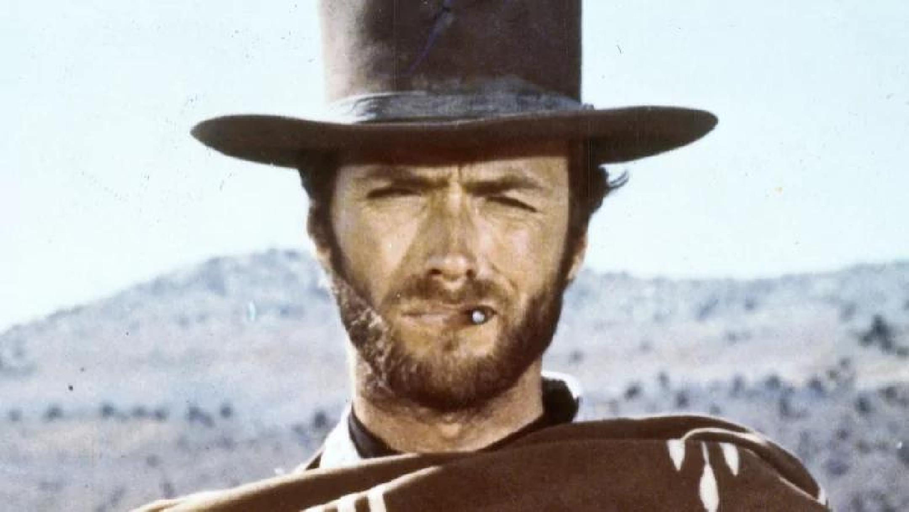
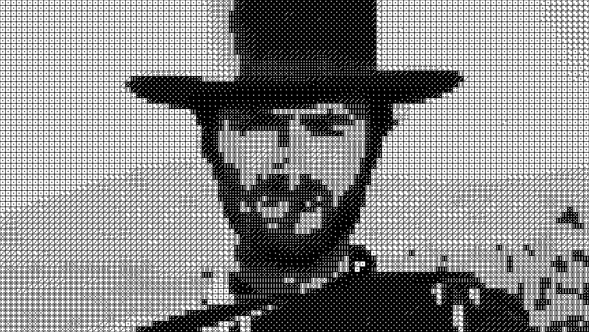

# 🎲 image2dice

> Turn any photo into a wall of dice. Yes, real dice. The kind you roll.

`image2dice` takes an image and spits out a **build plan** to recreate it using nothing but black and white dice. Each pixel-block becomes a die, and the number of pips (0–6) maps to a shade of grey. Glue a few hundred of them to a board and you've got yourself a dramatically over-engineered piece of art. 🖼️

| Source | Dice version |
|:------:|:------------:|
|  |  |

*Yes, that's Clint. Made of dice. You're welcome.*

---

## 🚀 Quick start

```bash
php image2dice.php clint.jpeg
```

That's it. You'll get two files and a textual build plan printed to your terminal.

### Outputs

| File | What it is |
|------|------------|
| `<name>_result.png` | The dice rendering — your visual reference 🎯 |
| `<name>_NB.png` | The pixelated grayscale preview (what the algorithm "sees") 👁️ |
| *stdout* | The **build plan**: row by row, how many dice of each face/color 🧾 |

A line of the build plan looks like `12 3W` → *"12 dice showing a 3, white side"*. `B` means black. Stack them up and start gluing.

---

## 🎛️ Options

```
php image2dice.php <options> filename.jpeg
```

| Flag | Effect |
|------|--------|
| `-0` | Don't use blank (zero-pip) faces 🚫 |
| `-w` | White dice only ⚪ |
| `-b` | Black dice only ⚫ |
| `-s W,H` | Set the width/height of a sampling block (in pixels) 📐 |
| `-v` | Verbose / debugging info 🐛 |

> ⚠️ `-w` and `-b` are mutually exclusive — pick a side.

### Examples

```bash
# High contrast, white dice, no blank faces
php image2dice.php -w -0 portrait.jpeg

# Coarser grid (bigger blocks = fewer dice = less glue)
php image2dice.php -s 40,40 landscape.jpeg

# Show me everything that's happening
php image2dice.php -v cat.jpeg
```

---

## 🧠 How it works

1. **Chop** the image into blocks (default `20×20`px).
2. **Average** each block down to a single grey value.
3. **Quantize** all those greys into a handful of levels — one per available die face.
4. **Map** each level to a die: faces `0–6` are white dice, `7–13` are black dice (the same six faces, flipped).
5. **Render** the result and print the shopping/build list. 🛒

---

## 📦 Requirements

- PHP with the **GD** extension enabled
- A source image in **JPEG** format
- A frankly unreasonable number of dice 🎲🎲🎲

---

## 🎨 Tips

- More blocks (smaller `-s`) → more detail, but exponentially more dice.
- Faces of black and white dice are the same — only the contrast direction changes. Mixing both gives you the widest tonal range.
- Start with `_NB.png` to check the framing before committing to a few thousand dice.

Happy rolling. 🎲
